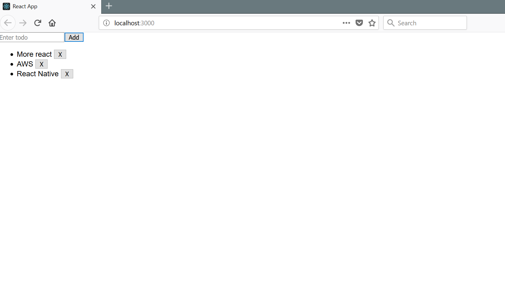

This is a simple bulleted todo list app that allows you to add and remove todo. The purpose of this project is to get more used to React and its syntax.

You can run this by running 

npm install

and then

npm start

Original Author: Teddy Liu

updated 6/25/18
